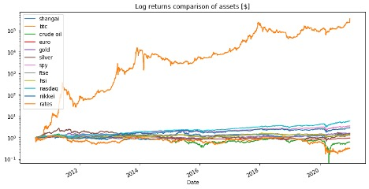
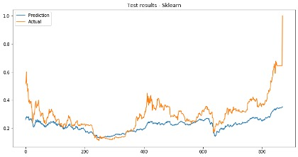

# ml-finance-btc
Using Machine Learning models to forecast and predict Bitcoin price movements.

## Requirements

In order to run this project, you will need to run the Jupyter Notebooks in the proper order, using [`AWS Sagemaker`](https://aws.amazon.com/sagemaker/). Please mind the following:

- Use default Sagemaker SDK (at the time of this writing it is SDK 2.0)
- Use MXnet 36 compatible jupyter notebooks to run the notebooks in the relevant order
- A requirements.txt file is included, but *it is not necessary to install them*. By running the first cell on the first notebook, Sagemaker will be able to install the necessary libraries needed outside Sagemaker (which are `yfinance` and `Quandl`)

## Abstract

Since its release in 2008, **Bitcoin** has marveled the world as a financial asset and store of value, however given its relatively short life span, the factors affecting its price have not been properly identified, price forecasts of traders are highly biased with emotions and opinions and its high volatility can be rarely predicted to create profitable trades.

In this project, we gathered a vast set of stock market indexes and commodities price data, interest rates, fundamental Bitcoin parameters (such as hashrate and transactions) and technical indicators (such as relative strength index and moving averages), used **Principal Component Analysis** to reduce its dimensionality and applied **XGBoost** and **Sklearn’s Neural Network models** to forecast day-ahead Bitcoin prices (as a regression problem) and predict its price movements (classification problem, using buy, sell and stay out labels). 

As a result, with the PCA model we could reduce the dimensionality of the original dataset from 27 to 6 features, preserving more than 90% of the variance. When forecasting Bitcoin prices, Sklearn's neural network performed better than XGBoost, both visually (similarity of the curve) and also on the root mean square error on the testing data set (0.10 vs 0.15). When predicting trading signals using multi-class classification, both models resulted in low accuracy (31-60%). This might be due to a natural bias of the feed-in data set, since in historical data Bitcoin shows a higher tendency to have positive daily returns. In future studies, shuffling the dataset before training and validating is recommended and could potentially improve results.

## Project design and methodology

In order to achieve a solution to the above-mentioned problem, I’ve split the project into four notebooks containing all the necessary steps on the machine learning workflow, from data sourcing, to model selection, hyperparameter tuning and model deployment and testing. Each notebook is named and includes the following:

1.	**Data sourcing and preparation**: Includes data sourcing and visualizations, data cleaning (for example, NA values), normalization of data sets and correlation analysis.

2.	**Feature engineering**: Includes Principal Component Analysis and feature assessment.

3.	**XGBoost**: Includes price forecasting and multi-class trading signal predictor, and partial results analysis from the XGBoost model used.

4.	**Neural network**: Includes price forecasting and multi-class trading signal predictor, plus final discussion and results comparison of both models.

By the end of the project, we would have a better idea of the different variables affecting the price of this revolutionary asset, and a predictor of its price movements. This project was the author's capstone project of Udacity's *Machine Learning Engineer nanodegree*.

## Copyright Notice

Feel free to use, contribute with code and distribute at will. 

Do you want to apply machine learning models on other assets, real-life trading or professional applications? **Get in touch with the author**.

### Contribute

**BTC**: 3EDoKkQ6fm7gzPeUHiktxQiVui1PSqQhEJ

**ETH**: 0x710A7382B31C1cc9E85470d693787DCBaFf2dE85

## References

Chalvatzis, C., Hristu-Varsakelis, D., 2020. High-performance stock index trading via neural networks and trees. Applied Soft Computing, Vol. 96, November 2020, 106567.

Pang, X., Zhou, Y., Wang, P., Lin, W., Chang, V., 2020. An innovative neural network approach for stock market prediction. The Journal of Supercomputing 76, 2098-2118(2020).

Satoshi Nakamoto, 2008. [Bitcoin: A Peer-to-Peer Electronic Cash System.](https://bitcoin.org/bitcoin.pdf)

The Economist (2019) [The Rise of the Financial Machines](https://www.economist.com/leaders/2019/10/03/the-rise-of-the-financial-machines). The Economist Group Limited, London 2019.

Waqar, Muhammad & Dawood, Hassan & Guo, Ping & Shahnawaz, Muhammad & Ghazanfar, Mustansar ali., 2017. Prediction of Stock Market by Principal Component Analysis. 13th International Conference on Computational Intelligence and Security (CIS).

Zhong X. Enke D, 2017. Forecasting daily stock market return using dimensionality reduction. Expert Systems with Applications, Vol. 67, January 2017, Pages 126-139.
